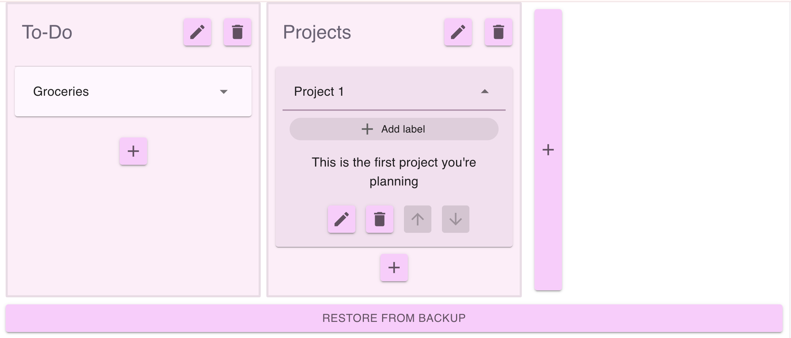

## Project Tracker

This project tracker app runs locally and allows you to track your projects without needing to connect to the internet, create an account, or use AI-heavy tools like Trello. All the information is saved to a file on your computer locally.

### Start-up

##### Install Node.js

- If you're starting from scratch, start by installing Homebrew, a tool that allows you to install other packages.
- Open your Terminal (on Mac) and paste this ` /bin/bash -c "$(curl -fsSL https://raw.githubusercontent.com/Homebrew/install/HEAD/install.sh)"` to install Homebrew
- Once Homebrew is installed, type `brew install node` to download and install Node.js

##### Install node packages.

- Download this package by going to "<> Code" button on Github and clicking "Download Zip".
- Go to the download location (or move the file to where you want it) and unzip the folder. Then hold "option" while right clicking on the folder. Click `Copy "project-tracker-main" as Pathname`
- Go back to your Terminal and type `cd `, then paste your pathname and hit enter. Mine looks like `cd '/Users/be/Documents/Projects/project-tracker-main'`. (`cd` means _change directory_)
- Install the required packages for project-tracker by running `npm run install-all` in your Terminal.

##### Using the app.

- Open your Terminal. If you aren't already in the directory for project-tracker, use the steps from "Install node packages" to `cd` into your project-tracker-main directory.
- Run `npm start` to start the application.
- In your browser, navigate to "http://localhost:3000/", where you should see the application running.
- From here, you can add projects or new lists. Each project has a title, description, and can have custom labels. You can move the cards up and down the list, or from one list to another.
- All of this information is saved in the "./server/projectData.json" file on your local device.
- When you're done running the app, go to your terminal and press "ctrl+C" to stop the app. All of your information should be saved to that file. Additionally, on shut down, the project will save to a backup file.
- If anything happens to your main project file, you can click "Restore from Backup" and it will reload what you had the last time you quit.

##### Any issues?

Feel free to contact me with any issues that come up at _belavelle at proton dot me_
